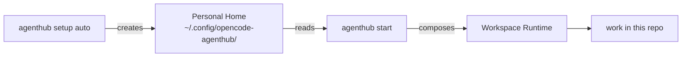
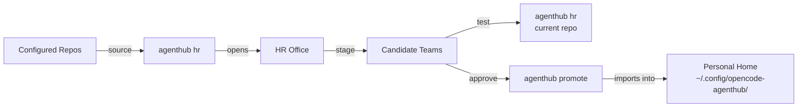

# opencode-agenthub

> Requires Node >= 18.0.0. Supports macOS and Linux directly. Windows users should use WSL 2 for the best experience; native Windows support remains best-effort alpha.

`opencode-agenthub` is a control plane and CLI for organizing, composing, and activating OpenCode agents, skills, profiles, bundles, and workspace runtime setup.

The npm package name is `opencode-agenthub`. The CLI command is `agenthub`. `opencode-agenthub` also works as a compatibility alias.

---

## Do you have this problem?

If any of these sound familiar, Agent Hub is for you:

- your agents, prompts, and skills are scattered across random folders
- every project needs slightly different AI behavior, but managing that by hand is messy
- you want a clean default `plan / build / auto` setup instead of rebuilding it each time

Or maybe this sounds more like you:

- you want to build your own agents, but you do not want to keep adjusting your global config or global plugins every time
- you want to build your own agents, but you do not know how to turn strong public GitHub repos into something reusable in your own setup
- you want HR help to assemble reusable agent teams from strong public GitHub agent / skill repos without polluting your normal setup

If yes, Agent Hub gives you a clear structure for building your own agent and skill library, along with an HR system that helps you assemble one.

---

## What it gives you

- one clean home for your reusable agent assets
- one simple built-in coding setup: `auto / plan / build`
- one per-workspace runtime, so each repo stays isolated
- one separate HR Office when you want to source or stage external assets

---

## Install

```bash
npm install -g opencode-agenthub
```

Then verify:

```bash
agenthub --version
agenthub --help
```

## Requirements

- Node >= 18.0.0 on `PATH`
- [opencode](https://opencode.ai) on `PATH`
- Python 3 on `PATH` for HR inventory sync and staged-package helper scripts
- Bun (for tests/development only)

### Platform support

| Platform | Status |
|---|---|
| macOS | Supported |
| Linux | Supported |
| Windows via WSL 2 | Supported and recommended |
| Native Windows | Best-effort alpha support |

For Windows users, install and run Agent Hub inside [WSL 2](https://learn.microsoft.com/en-us/windows/wsl/install). This matches OpenCode's recommended Windows setup and preserves expected POSIX behavior for bash launchers, Python helpers, symlinked skills, and shell tooling.

Native Windows is still best-effort in alpha. Agent Hub now emits a startup notice on native Windows, generates `run.cmd` alongside `run.sh`, and avoids a few common platform pitfalls, but HR and shell-centric workflows are still most reliable under WSL 2.

---

## Quick start

For most users, this is the whole onboarding flow:

### 1. Create your home

```bash
agenthub setup auto
```

This creates your Agent Hub home and installs the built-in `auto / plan / build` setup.

### 2. Confirm or change your default provider/model

`setup auto` imports your native opencode provider/model basics from:

- `~/.config/opencode/opencode.json`
- or `OPENCODE_AGENTHUB_NATIVE_CONFIG` if you set it

That is the first place to set your default AI provider.

After setup, Agent Hub also keeps the imported values in:

```text
~/.config/opencode-agenthub/settings.json
```

### 3. Start working in a repo

```bash
agenthub start
```

This composes your workspace runtime and launches your default team.

### 4. (Optional) Call HR to assemble a customized team

```bash
agenthub hr
```

See details in the `HR Office` section.

---

## Agenthub setup flow

`agenthub setup auto` creates your Personal Home with built-in coding assets. `agenthub start` reads from it and composes a Workspace Runtime for the current repo.



> **One-time:** `agenthub setup auto` - **Per-repo:** `agenthub start`

## HR flow

`agenthub hr` uses a separate HR Office - first launch syncs the default source repos plus the canonical model catalog into a local inventory, then HR walks through five reviewable stages: Requirements -> Staffing Plan -> Candidate Review -> Architecture Review -> Staging & Confirmation.



> **Isolated:** HR Office never touches your Personal Home until you explicitly run `agenthub promote <package-id>`.

---

## Everyday start commands

```bash
agenthub start
agenthub start last
agenthub start <profile>
agenthub start set <profile>
```

| Command | Effect |
|---|---|
| `agenthub start` | Start your current default team in this workspace |
| `agenthub start last` | Reuse the last profile used in this workspace |
| `agenthub start <profile>` | Start a specific profile in this workspace |
| `agenthub start set <profile>` | Save a new personal default profile |

If you want structure only and no built-in coding team yet:

```bash
agenthub setup minimal
```

---

## Asset model

Most users only need to remember two ideas:

- **bundle (agent)** = soul + agent config + optional skills / MCP / policy
- **profile** = bundles + plugins + launch defaults

### Main concepts

| Concept | What it is | Why it exists |
|---|---|---|
| **Soul** | The base prompt / behavior for an agent | Defines how an agent thinks and speaks |
| **Skill** | A reusable capability folder | Adds a specialized job or workflow |
| **Bundle (agent)** | A reusable worker definition | Connects a soul to model / permissions / skills / tools |
| **Profile** | A launchable team for one workspace | Chooses which bundles and plugins become active |

### Everyday runtime parts

| Part | What it does | Default location |
|---|---|---|
| **Personal Home** | Your reusable main library of souls, skills, bundles, profiles, and settings | `~/.config/opencode-agenthub/` |
| **Workspace Runtime** | The active composed runtime for one project | `<workspace>/.opencode-agenthub/current/` |

If you used `setup auto`, you already have a ready-to-run default profile.

---

## Common commands

| Command | Effect |
|---|---|
| `agenthub new soul reviewer` | Create a new soul scaffold |
| `agenthub new skill repo-audit` | Create a new skill scaffold |
| `agenthub new bundle reviewer` | Create a new bundle scaffold |
| `agenthub new profile my-team` | Create a new profile scaffold |
| `agenthub list` | List installed assets |
| `agenthub backup --output ./my-team-backup` | Back up your Personal Home |
| `agenthub restore --source ./my-team-backup` | Restore your Personal Home from a backup |

---

## Storage layout

### Personal Home

Default location:

```text
~/.config/opencode-agenthub/
```

Created up front:

```text
souls/
skills/
bundles/
profiles/
settings.json
```

Created only when you actually use them:

```text
instructions/
mcp/
mcp-servers/
```

### Workspace Runtime

Default location:

```text
<workspace>/.opencode-agenthub/current/
```

Workspace-specific memory lives in:

```text
<workspace>/.opencode-agenthub.user.json
```

That file stores things like:

- last-used `start` profile in this workspace
- last-used `hr` test profile in this workspace
- `.envrc` preference state

---

## How plain `opencode` fits in

When you start a profile in a workspace, Agent Hub can offer to generate `.envrc` so plain `opencode` works there without retyping `agenthub` every time.

That means:

- use `agenthub start ...` when you want to switch your normal workspace runtime
- use `agenthub hr <profile>` when you want to test an HR profile in a workspace
- then use plain `opencode` for day-to-day work inside that folder

---

## HR Office

Use `agenthub hr` when you want a separate place to source, test, adapt, or stage external agents or skills.

Default location:

```text
~/.config/opencode-agenthub-hr/
```

Override with `OPENCODE_AGENTHUB_HR_HOME`.

### HR commands

| Command | Effect |
|---|---|
| `agenthub hr` | Open or bootstrap the isolated HR Office |
| `agenthub hr <profile>` | Test an HR-home or staged HR profile in the current workspace before promote |
| `agenthub hr last` | Reuse the last HR profile tested in this workspace |
| `agenthub promote <package-id>` | Import an approved staged HR package into your Personal Home |

Typical staged-team flow:

1. HR builds a package under `~/.config/opencode-agenthub-hr/staging/<package-id>/`
2. Test it in your repo with `agenthub hr <profile>`
3. Promote it with `agenthub promote <package-id>` once satisfied

### HR runtime details

- HR syncs GitHub worker sources and a model catalog into `~/.config/opencode-agenthub-hr/inventory/`
- HR validates staged `provider/model` ids against that synced catalog instead of inventing names
- If a staged team should hide default opencode agents like `general`, `explore`, `plan`, and `build`, HR stages the profile with `nativeAgentPolicy: "team-only"`
- If approved during HR handoff, `agenthub promote <package-id>` can also make the promoted profile your new default bare `agenthub start` profile
- Model variants are stored separately as `model` + `variant`, not as one combined string

### Example prompts

- `I want an agent that can build and verify TypeScript CLIs. Use strong public references, shortlist candidates, and stage a package for me.`
- `I want a frontend architect agent for Next.js and a11y review. Please source references, compare them, and propose a team.`

### Default HR sources

HR Office bootstraps with these default GitHub sources:

- `garrytan/gstack`
- `anthropics/skills`
- `msitarzewski/agency-agents`
- `obra/superpowers`

It also bootstraps a default model catalog source:

- `https://models.dev/api.json`

Edit `~/.config/opencode-agenthub-hr/hr-config.json` to change either source set.

The synced model inventory is written under:

```text
~/.config/opencode-agenthub-hr/inventory/models/
```

This gives HR an exact local list of valid `provider/model` ids during architecture review and adaptation.

Two good repos to add yourself if they match your needs:

- `K-Dense-AI/claude-scientific-skills` - strong scientific and research-oriented skills, but more niche than the default set
- `affaan-m/everything-claude-code` - broad practical Claude Code workflow pack if you want a larger, more opinionated source library

---

## Advanced settings

Most users do not need these on day one.

- **Instruction** — shared extra guidance you can attach to bundles
- **MCP entry** — external tool server configuration that a bundle can mount

## Upgrade

Use this only when you install a newer package version and want to refresh built-in managed files in an existing home.

```bash
# preview built-in file changes
agenthub upgrade

# overwrite managed built-in files
agenthub upgrade --force
```

---

## Development

```bash
bun run test:smoke
npm run build
```
